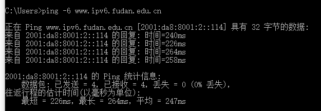

# CS305 Computer Network

## Lab1_Report

**SID**:  11811806  

**Name**:  熊卓晨

### Assignment

Q1. Query the ip address, subnet mask and MAC address of host.

   
  
Fig.1

The ipv4 address and ipv6 address  and mac address are show in the picture. The subnet mask is also on the picture:255.255.255.0. The dhcp on this computer are not open. So the address is allocated statically.  

If the host use dhcp, the result will like follow:

   
  
Fig.2

The lease time of ipv4 address is about **3 hours 7 minutes 34 seconds**. The lease time of fixed ipv6 address is so long. But the lease time of temporary Ipv6 address is 1 day **3 hours 38 minutes 38 seconds**. 

Q2. DNS provides the corresponding relationship between domain name and IP address. Please query

1. IP address of host’s DNS server 

   

      
     
Fig.1

   

2. DNS information cached in host 

   

      
     
Fig.2

   

3. IP address of www.cernet.edu.cn :202.205.109.203

   

      
     
Fig.3

   

Q3. Statistical analysis on the traffic on ICMP protocols, please list how many destination unreachable, echo reply, request timeout message are received on host?

   
  
Fig.1

|                         | received on host |
| ----------------------- | ---------------- |
| destination unreachable | 7179             |
| echo reply              | 63               |
| request timeout message | 0                |
|                         |                  |

Q4. What's the default value of max hops while process 'tracert' command, can this value be changed? Use the ‘tracert’ to access 'www.bilibili.com', find out the total number of hops from the local host to the target. Are there any ICMP messages lost during the tracert process? what's the IP address of the your PC's gateway.

   
  
Fig.1

The default max hops is 30, this value can be change.Such as:

   
  
Fig.2

We can change it to 40. 

If we ping this server, we neee 16 hops.

There are 3 hops lost.

The IP address of my PC's gateway is 172.18.5.254

Q5. Find a web site with IPv6 address, use command to check if it is reachable or not. what's the IPv6 address of the host, is '::1' a legal or illegal IPv6 address.

   
  
Fig.1

We find an ipv6 site of fudan university. This site can be reach.

'::1' is a legal IPv6 address ,  and we can ping it.
