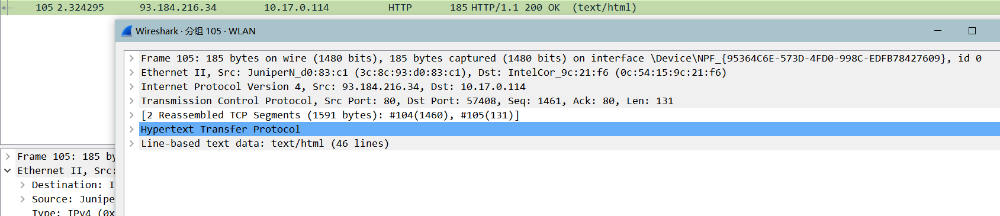
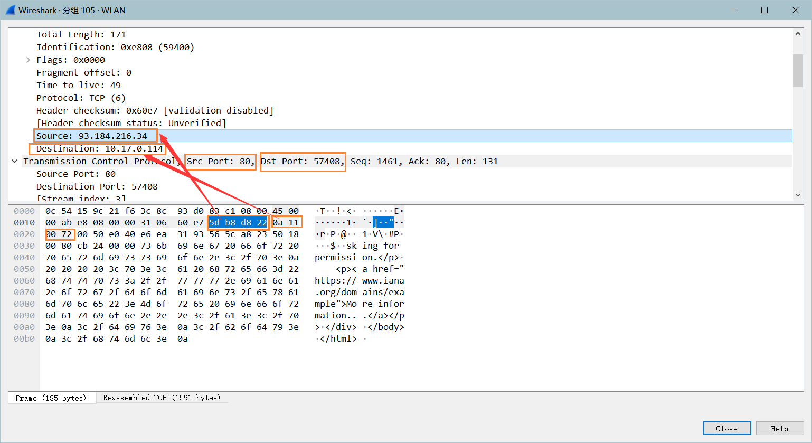
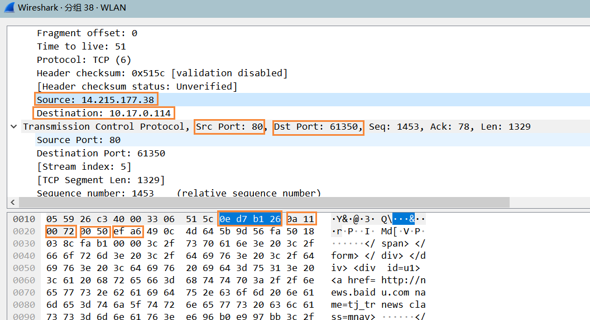
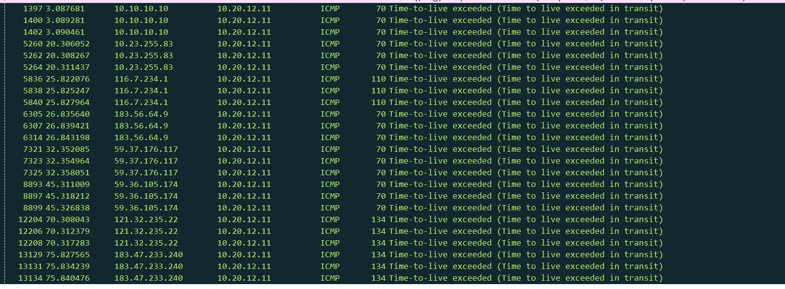
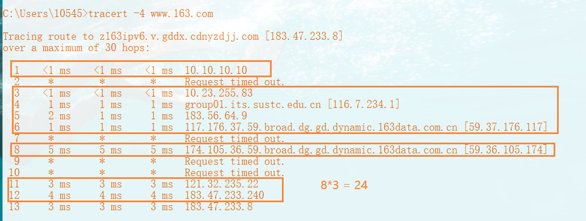
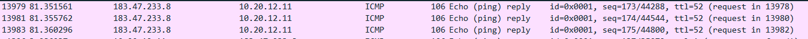
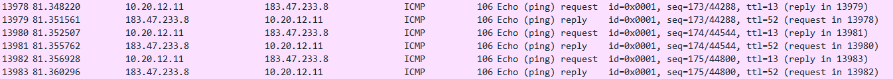

# CS305 Computer Network

## Lab1_Report

**SID**:  11811806  

**Name**:  熊卓晨

### Describe

#### A2.1

Find Narcissistic Number 

* filename: narcissistic_number.py 

* requirement: implement a function to find all the narcissistic numbers in a range

#### A2.2

Use Wireshark to capture packets and answer the questions with your screenshots: 1. launch a http session between your host and “www.example.com” 1-1. what 's the filter used for the HTTP session between your host and “www.example.com”? 1-2. Find a HTTP response packet in this http session. what's the decimal and hexdecimal representation of the src ip addr, src port, dst ip addr and dst port of this packet. 2. launch a http session between your host and “www.baidu.com” 2-1. answer the question 1-2 based on the new http session between your host and “www.baidu.com” 2-2. list the items which value is same in the answers of both question 1-2 and 2-1.

#### A2.3

Using ICMPv4 to trace route between your computer(source) and “www.163.com”(destionation). Using a proper capture filter/display filter to capture/display this session. Answer the following questions with words and screenshots on both the execution result of command and capture result of wireshark: 1. How many 'time-to-live exceed' and 'echo reply' response messages are received ? What’s the source IP address of the 1st received 'time-to-live exceed' message, What’s the source IP address of the 1st received ‘echo reply' message? 2. Calculate the RTT (round-trip time) between your host and www.163.com based on the packets captured. Are they same with RTT from command execution result? 3. Add the value of hops(between source and destination) and TTL value of ICMPv4 messages received by source( which send ICMPv4 echo request). Is it the initial value of TTL from ICMPv4 message send by source or the ICMPv4 message send by destination? how to prove this conclusion

### Assignment2.1

The file have been uploaded,the code is as follow

```python
import math
def find_narcissistic_number(start:int,end:int)->list:
    ans_list = []
    for x in range(start,end+1):
        nums_list = []
        nums = 0
        tmp = x
        while tmp != 0:
            # print(str(nums) + "," +str(tmp))
            nums_list.append(tmp%10)
            tmp //= 10
            nums += 1
        sum = 0
        for i in range(0,nums):

            sum += int(pow(nums_list[i],nums))
        if sum == x:
            ans_list.append(x)
    return ans_list

if __name__ == '__main__':
    print(str(find_narcissistic_number(1,1000000)))
```

 ### Assignment2.2

**1-1:** Use "**http and ip.addr==93.184.216.34**" in filter

**1-2:**

This is the HTTP response packet in this htp session.

<div>
  <br />
  <div>Fig.1</div>
</div>

Here are the details:

<div>
  <br />
  <div>Fig.2</div>
</div>

**Decimal**

* src ip addr: 93.184.216.34
* src port: 80
* dst ip addr: 10.17.0.114
* dst port:57408

**Hexdecimal**

* src ip addr: 5d.b8.d0.22
* src port: 00 50
* dst ip addr: 0a.11.00.72
* dst port: e0 40

**2-1**

<div>
  <br />
  <div>Fig.3</div>
</div>

**Decimal**

* src ip addr: 14.215.177.38
* src port: 80
* dst ip addr: 10.17.0.114
* dst port:57408

**Hexdecimal**

* src ip addr: 0e.d7.b1.26
* src port: 00 50
* dst ip addr: 0a.11.00.72
* dst port: ef a6

**2-2**

**src port** and **dst ip addr**

### Assignment2.3

**3-1**

<div>
  <br />
  <div>Fig.1</div>
</div>

<div>
  <br />
  <div>Fig.2</div>
</div>

There are 24 TTL exceed response messages are received. 

<div>
  <br />
  <div>Fig.3</div>
</div>

There are 3 echo reply reponse messages.

The  source IP address of the 1st received 'time-to-live exceed' message is **10.10.10.10**

 The source IP address of the 1st received ‘echo reply' message is **183.47.233.8**

**3-2**

In **Command Line,** According to Fig.2 we have the RTT is **3ms.**

<div>
  <br />
  <div>Fig.4</div>
</div>

In **wireshark,** RTT = 81.351561-81.348220 = 0.003341 s $\approx$ **3ms**.

**3-3**

According to Fig.2, the value of hops is 13. TTL value of ICMPv4 message received by source is 52 and the sum is **52+13=65$\neq$ 13**

According to ICMP principle, during a tracert, source (taking my computer as an example) will send several packets to the near server/router, whose TTL is increasing by 1 for each hop. So when the destination server send a echo reply ICMP packet, each middle server/router will reduce 1 TTL. That means the initial TTL equals to the received packet's TTL plus hops.

### Summary

In this Lab, we lean abouthow to use python and use wireshark to capture **http** and **ICMP** packets. 

