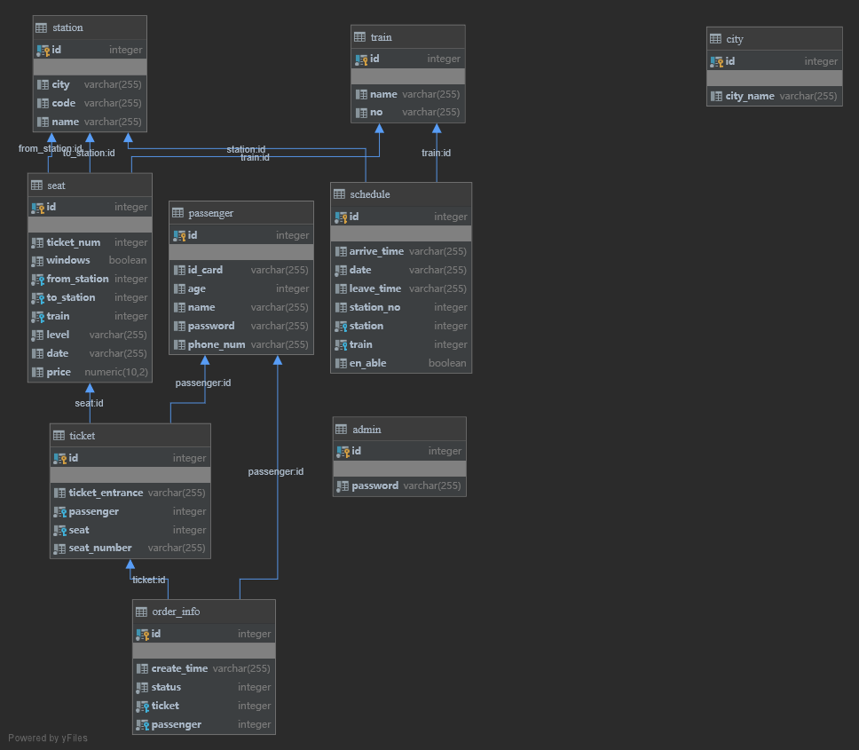

# DBproject_fall2020

模仿12306设计的购票系统，前端用户界面使用JavaFX搭建，后端服务与数据库交互使用**Springboot**搭建，数据库使用**PostgreSQL**项目中使用到了**Spring-JPA**对数据库进行操作。数据库位于阿里云学生机，前后端可以在本地部署进行演示。功能上，管理员可进行增删查改**站点**、**车次**、**用户信息**等行为， 普通用户可进行**查询**（城市、车站、转乘推荐），**购票** ，**订单操作**，**修改个人信息**等行为。

### 项目文件夹

* **script:** 一些项目中用到的python脚本

* **dbproj:** 基于Springboot的后端服务

* **Administartor & User:** 前端用户交互

### 项目数据来源

* **车辆行程表** ：12306旧版API，全国五月份（有一些车次一个月只开几次，五月初爬取，可能有部分车次有停运等变动） 
* **座位表** ：根据车的类型（G/D/T/K/Z等）自动生成座位等级（卧/坐/站及座位等次），默认余票五张 
* **车站** ：数据来自12306的车站电报码表，**对应城市**数据通过爬取**维基百科**用**正则**提取,可能存在少量错误。
  * 

### 数据库设计

#### 数据库表设计图

#### 数据库相关设计

* **Trigger**：身份证/手机号合法性
* **Index**：较大的表（schedule、seat）加入了一些index加快查询
* **主键外键**： 大部分表正常使用外键维护关系，个别情况下使用代码逻辑维护关系

### 并发性测试

因为不涉及Web前端，所以并发性能上主要考虑加快数据库的操作，不涉及分布式部署及网络上的一些优化手段。通过粗略的压力测试可以得到一些结论(*压测的图表可参考答辩的pdf*)：

* 较高的并发量不会使后端程序崩溃，可以看到在三种不同程度的压力下后端的数据吞吐量 （thoughput）基本是保持不变的 
* 看到并发量在100时不会发生数据丢失，响应时间在可忍耐范围，1000/10000并发量下会出现不同程度的数据丢失，但是绝大部分请求能够正确响应，但响应时间较长
* 测试数据基本符合单机Springboot的处理能力。

### 项目总结

* 数据库的项目本质还是让我们熟悉使用数据库工具，写了不少SQL语句，当时可能是我SQL语句能力的巅峰...
* 迫于同辈压力第一次尝试使用Web后端的开发框架Springboot，使用的功能都比较简单，也体会到了**保姆式**的后端开发，是一次不错的体验。
* 对并发性及一些性能优化的考虑欠缺，希望后面通过更深入的学习了解更多。
* 多尝试新技术，可能会有很多惊喜在前面等着我。多学习体验一些更现代化的语言和框架吧。用新东西完成一个项目的成就感还是很高的。
